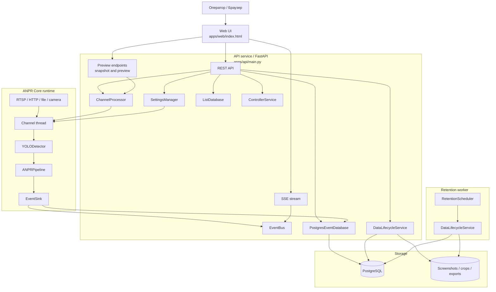
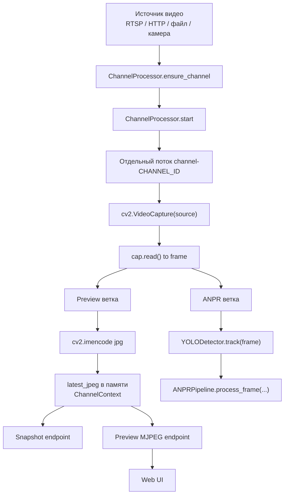
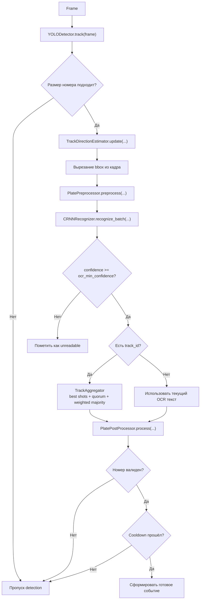
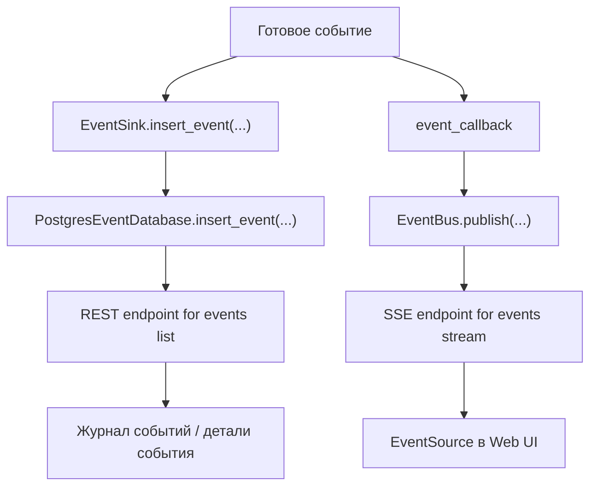
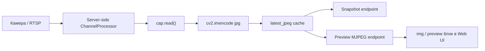
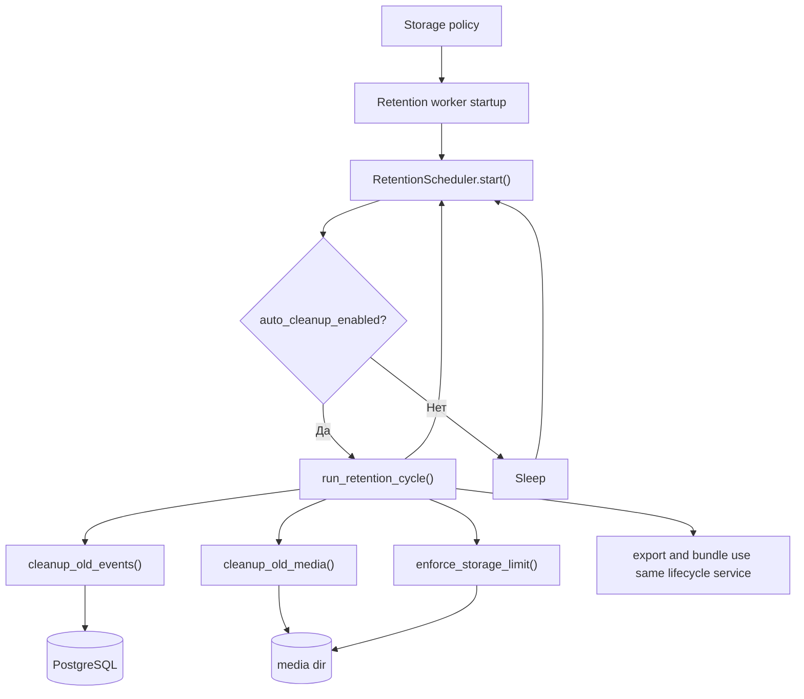

# ANPR System v0.8 Web


Web-first система автоматического распознавания автомобильных номеров.

Проект выполняет server-side обработку видеопотоков, распознаёт номера, сохраняет события, публикует live-обновления в браузер и отдаёт live preview без отдельного медиасервера.

---

## Что умеет система

- многоканальная обработка видео: отдельный runtime на каждый канал;
- server-side ANPR pipeline: детекция, OCR, агрегация по треку, постобработка, cooldown;
- web UI оператора: наблюдение, журнал, списки, настройки;
- live preview по MJPEG из того же channel runtime;
- live-события через SSE;
- управление каналами через API: создать, изменить, запустить, остановить, перезапустить;
- настройка ROI, размера номера, OCR порогов, cooldown и direction heuristics;
- white/black/custom plate lists;
- управление контроллерами через API;
- retention / cleanup / CSV / ZIP export;
- PostgreSQL как единственный supported storage backend.

---

## Как устроен проект

Система разделена на три основных контура:

1. **API service**  
   FastAPI приложение, которое:
   - обслуживает web UI;
   - хранит и отдаёт настройки;
   - управляет каналами;
   - публикует live events;
   - отдаёт snapshot и MJPEG preview.

2. **Channel runtime / ANPR Core**  
   Для каждого канала создаётся отдельный поток обработки, который:
   - открывает источник видео;
   - читает кадры;
   - формирует preview JPEG в памяти;
   - прогоняет кадры через YOLO + OCR pipeline;
   - сохраняет события в storage;
   - отправляет события в EventBus.

3. **Retention worker**  
   Отдельный сервис для:
   - очистки старых событий;
   - удаления старых медиа;
   - контроля размера media storage;
   - экспорта CSV / ZIP.

---

## Важное замечание по текущей реализации

Runtime канала поддерживает два режима обработки:

- `detection_mode="always"` — каждый кадр проходит стандартную ветку `detector.track(frame) -> pipeline.process_frame(...)`.
- `detection_mode="motion"` — перед ANPR используется `MotionDetector`:
  - preview (`latest_jpeg`, `snapshot.jpg`, `preview.mjpg`) продолжает обновляться всегда;
  - ANPR-вычисления запускаются только при активном движении;
  - дополнительно учитывается `detector_frame_stride`, чтобы ограничить частоту вызова detector даже при активном движении.

Если `detection_mode` отсутствует или имеет неизвестное значение, применяется безопасный fallback на `always`.

---

## Диаграмма 1. Общая схема взаимодействия сервисов



---

## Диаграмма 2. Что происходит после подключения видеопотока

Эта схема отвечает на вопрос: как канал получает видео, где рождается preview и куда уходит кадр на распознавание.



---

## Диаграмма 3. Внутренний ANPR pipeline

Это основная процессная диаграмма распознавания номера в текущем проекте.



---

## Диаграмма 4. Как событие сохраняется и попадает в UI



---

## Диаграмма 5. Как работает video preview для UI

Здесь важно, что браузер получает не прямой RTSP, а уже подготовленный сервером MJPEG поток.



---

## Диаграмма 6. Retention и обслуживание хранения



---

## Поток данных по шагам

### 1. Подключение канала

При старте API читает список каналов из `settings.yaml`.  
Для каждого канала `ChannelProcessor` создаёт `ChannelContext`.  
Если канал `enabled=true`, для него сразу запускается отдельный thread.

### 2. Получение кадров

Поток канала открывает источник через `cv2.VideoCapture(source)` и в цикле вызывает `cap.read()`.

Если чтение кадра не удалось:
- увеличиваются `timeout_count` и `reconnect_count`;
- preview помечается как недоступный;
- источник открывается заново.

### 3. Формирование preview

Примерно раз в `0.2` секунды текущий кадр кодируется в JPEG и сохраняется в память:
- `latest_jpeg`
- `latest_frame_ts`
- `preview_ready`
- `preview_last_frame_at`

Дальше API отдаёт этот же буфер:
- как единичный снимок через `/api/channels/{id}/snapshot.jpg`;
- как multipart MJPEG поток через `/api/channels/{id}/preview.mjpg`.

### 4. Детекция и распознавание

Тот же кадр идёт в:
- `YOLODetector.track(frame)`;
- затем в `ANPRPipeline.process_frame(frame, detections)`.

Внутри pipeline выполняются:
- обновление направления движения по треку;
- кроп bbox номера;
- preprocessing;
- batch OCR;
- агрегация результата по треку;
- постобработка и валидация;
- cooldown-фильтр.

### 5. Сохранение события

Если номер валиден и cooldown прошёл, формируется событие с полями:
- `timestamp`
- `channel`
- `channel_id`
- `plate`
- `country`
- `confidence`
- `source`
- `direction`

Событие записывается в storage через `EventSink`.

### 6. Публикация события в UI

После записи событие публикуется в `EventBus`, а затем попадает в браузер через `/api/events/stream`.

UI параллельно:
- держит live stream для новых событий;
- подгружает исторические события через `/api/events`;
- открывает детали события и связанные изображения через `/api/events/item/{id}` и `/api/events/item/{id}/media/{kind}`.

---

## Основные компоненты

### Backend / API

- `apps/api/main.py` — главный FastAPI backend;
- `apps/api/data_lifecycle.py` — retention, cleanup, export;
- `packages/anpr_core/channel_runtime.py` — runtime каналов;
- `packages/anpr_core/event_bus.py` — in-memory pub/sub для live событий;
- `packages/anpr_core/event_sink.py` — запись событий в PostgreSQL.

### ANPR

- `anpr/detection/yolo_detector.py` — детектор номерных рамок и tracking fallback logic;
- `anpr/pipeline/anpr_pipeline.py` — OCR pipeline, aggregator, direction estimator, cooldown;
- `anpr/preprocessing/plate_preprocessor.py` — коррекция перспективы / наклона;
- `anpr/recognition/crnn_recognizer.py` — OCR CRNN;
- `anpr/postprocessing/validator.py` — валидация по конфигам стран;
- `anpr/detection/motion_detector.py` — модуль motion detection, пока не включён в основной runtime path.

### Web UI

`apps/web/index.html` — операторская панель с вкладками:
- Наблюдение;
- Журнал;
- Списки;
- Настройки.

### Worker

`apps/worker/main.py` — отдельный retention worker.

---

## REST / streaming endpoints

### Базовые

- `GET /` — web UI;
- `GET /api/health` — health API.

### Каналы

- `GET /api/channels`
- `POST /api/channels`
- `PUT /api/channels/{channel_id}`
- `DELETE /api/channels/{channel_id}`
- `GET /api/channels/{channel_id}/config`
- `PUT /api/channels/{channel_id}/config`
- `PUT /api/channels/{channel_id}/ocr`
- `PUT /api/channels/{channel_id}/filter`
- `POST /api/channels/{channel_id}/start`
- `POST /api/channels/{channel_id}/stop`
- `POST /api/channels/{channel_id}/restart`
- `GET /api/channels/{channel_id}/health`
- `GET /api/channels/{channel_id}/snapshot.jpg`
- `GET /api/channels/{channel_id}/preview/status`
- `GET /api/channels/{channel_id}/preview.mjpg`

### События

- `GET /api/events`
- `GET /api/events/item/{event_id}`
- `GET /api/events/item/{event_id}/media/frame`
- `GET /api/events/item/{event_id}/media/plate`
- `GET /api/events/stream`

### Контроллеры

- `GET /api/controllers`
- `POST /api/controllers`
- `PUT /api/controllers/{controller_id}`
- `DELETE /api/controllers/{controller_id}`
- `POST /api/controllers/{controller_id}/test`

### Списки

- `GET /api/lists`
- `POST /api/lists`
- `GET /api/lists/{list_id}/entries`
- `POST /api/lists/{list_id}/entries`

### Хранение и экспорт

- `GET /api/data/policy`
- `PUT /api/data/policy`
- `POST /api/data/retention/run`
- `GET /api/data/export/events.csv`
- `POST /api/data/export/bundle`

### Глобальные настройки

- `GET /api/settings`
- `PUT /api/settings`

### Worker

- `GET /worker/health`
- `POST /worker/retention/run`

---

## Технологический стек

- **Backend:** FastAPI, Uvicorn
- **Detection:** YOLOv8 (Ultralytics)
- **OCR:** CRNN
- **Видео:** OpenCV
- **ML:** PyTorch 2.8.0, torchvision 0.23.0, torchaudio 2.8.0
- **Live updates:** SSE
- **Preview:** MJPEG
- **Storage:** PostgreSQL
- **Worker:** отдельный FastAPI-based retention service

---

## Структура проекта

```text
ANPR-System-v0.8_web/
├── apps/
│   ├── api/                 # backend API, preview, export, settings
│   ├── worker/              # retention worker
│   ├── web/                 # web UI
│   └── video_gateway/       # legacy / optional
├── packages/
│   └── anpr_core/           # channel runtime, event bus, sink
├── anpr/
│   ├── detection/
│   ├── pipeline/
│   ├── preprocessing/
│   ├── recognition/
│   ├── postprocessing/
│   └── infrastructure/
├── database/
│   ├── postgres/           # SQL-схема и init-артефакты PostgreSQL
│   └── README.md
├── docker-compose.yml
├── config/
├── models/
├── scripts/
├── data/
├── logs/
├── requirements.txt
├── .env
├── .env.example
├── settings.yaml
└── settings.example.yaml
```

---

## Установка

### Предварительные требования

- Python 3.13
- pip
- OpenCV runtime dependencies
- модели YOLO и OCR в каталоге `models/`

### Клонирование

```bash
git clone https://github.com/quick-1y/ANPR-System-v0.8_web.git
cd ANPR-System-v0.8_web
```

### Установка зависимостей

#### CPU

```bash
pip install -r requirements.txt --index-url https://download.pytorch.org/whl/cpu --extra-index-url https://pypi.org/simple
```

#### CUDA 12.8 / PyTorch 2.8.0

```bash
pip install torch==2.8.0 torchvision==0.23.0 torchaudio==2.8.0 --index-url https://download.pytorch.org/whl/cu128
pip install -r requirements.txt --extra-index-url https://pypi.org/simple
```

---


## Схема конфигурации

- `.env` — переменные окружения, секреты и deploy/runtime-параметры (DSN, порты, `LOG_LEVEL`, `APP_ENV`, `DEBUG`, `SETTINGS_PATH`).
- `settings.yaml` — прикладной runtime-конфиг системы (каналы, ROI, thresholds, контроллеры, правила обработки).
- PostgreSQL — runtime-данные (события, списки и записи).

## Локальный запуск

1) Скопируйте примеры конфигурации и заполните их под своё окружение:

```bash
cp .env.example .env
cp settings.example.yaml settings.yaml
```

2) Запустите сервисы в двух терминалах (или через process manager), передав `--env-file .env` для uvicorn:

### 1. API + Web UI

```bash
python -m uvicorn apps.api.main:app --host 0.0.0.0 --port 8080 --env-file .env
```

### 2. Retention worker

```bash
python -m uvicorn apps.worker.main:app --host 0.0.0.0 --port 8092 --env-file .env
```

### Точки доступа

- Web UI: `http://localhost:8080`
- API health: `http://localhost:8080/api/health`
- Live preview MJPEG: `http://localhost:8080/api/channels/{id}/preview.mjpg`
- Worker health: `http://localhost:8092/worker/health`

---

## Docker Compose

```bash
docker compose up --build
```

Поднимаются сервисы:
- `api`
- `retention_worker`
- `postgres`

Инициализация PostgreSQL выполняется через `database/postgres/schema.sql`.

Compose загружает переменные из `.env` и передаёт их сервисам.
Ключевые переменные: `POSTGRES_DSN`, `SETTINGS_PATH`, `API_PORT`, `WORKER_PORT`, `POSTGRES_*`.

---

## Хранение данных

### PostgreSQL (обязательно)

События и списки номеров хранятся только в PostgreSQL через `POSTGRES_DSN` из `.env`.

Если PostgreSQL временно недоступен, сервисы продолжают работать, а DB-зависимые endpoints возвращают controlled degradation (HTTP 503 или `status=error` для retention run).

### Медиа и экспорт

- медиа сохраняются в `screenshots_dir`;
- CSV экспорт создаётся в `export_dir`;
- bundle export упаковывает CSV и доступные медиа в ZIP.

---

## Диагностика preview и live runtime

### Проверка канала

```bash
curl http://localhost:8080/api/channels
```

Полезные поля в `metrics`:
- `state`
- `fps`
- `latency_ms`
- `preview_ready`
- `preview_last_frame_at`
- `last_error`
- `reconnect_count`
- `timeout_count`

### Проверка preview status

```bash
curl http://localhost:8080/api/channels/1/preview/status
```

### Быстрый snapshot

```bash
curl -o snapshot.jpg http://localhost:8080/api/channels/1/snapshot.jpg
```

### MJPEG preview

Откройте в браузере:

```text
http://localhost:8080/api/channels/1/preview.mjpg
```

### Worker health

```bash
curl http://localhost:8092/worker/health
```

---

## Что ещё важно знать

- preview и ANPR используют один и тот же ingest канала;
- браузер не подключается к RTSP напрямую;
- если чтение потока ломается, runtime пытается открыть источник заново;
- live события идут отдельно от preview: preview — через MJPEG, события — через SSE;
- в UI уже есть настройки motion detection, но основной runtime сейчас работает через прямой `YOLODetector.track(frame)` без отдельного motion gate;
- endpoint `/api/events/stream` реализован как короткий SSE stream, а клиентская часть переподключается повторно.

---

## Статус проекта

Текущая версия — **web-only ANPR system**.

Desktop UI больше не является основным способом работы; основной интерфейс — операторская web-панель.

---

## License

MIT
