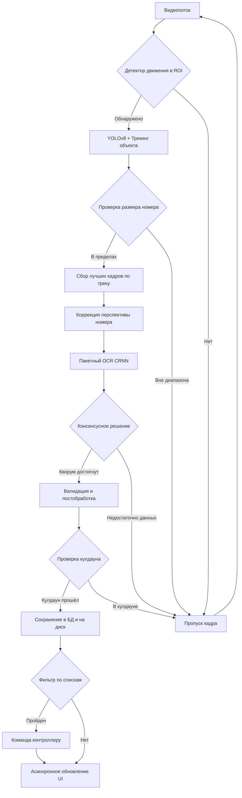

# ANPR System - Automatic Number Plate Recognition


Web-first платформа для автоматического распознавания автомобильных номеров с поддержкой многоканального видео, локальной базой данных и интеллектуальной обработкой в реальном времени.

> ℹ️ Проект находится в фазе миграции на web-архитектуру.
> - Артефакты Этапа 0 (аудит и проектирование): `docs/migration/stage0/`
> - Артефакты Этапа 1 (каркас ANPR Core Service): `docs/migration/stage1/`
> - Артефакты Этапа 2 (Video Gateway): `docs/migration/stage2/`
> - Артефакты Этапа 3 (Event & Telemetry): `docs/migration/stage3/`
> - Артефакты Этапа 4 (Web UI MVP): `docs/migration/stage4/`
> - Артефакты Этапа 5 (Data Layer): `docs/migration/stage5/`
> - Артефакты Этапа 6 (Stabilization): `docs/migration/stage6/`

## 🚀 Основные возможности

- **Многоканальный мониторинг** — одновременная работа с несколькими видеопотоками (RTSP/файлы/веб-камера)
- **Адаптивная детекция движения** — умный запуск распознавания только при наличии движения в зоне интереса (ROI)
- **Трекинг и агрегация** — отслеживание объектов с голосованием по лучшим кадрам для повышения точности
- **Анализ направления движения** — классификация треков на приближение/удаление по динамике номера
- **Локальное хранение** — SQLite база событий с автоматическим созданием скриншотов
- **Списки номеров** — белые/черные списки с комментариями, импортом/экспортом и быстрым фильтром для принятия решений
- **Сетевые контроллеры** — настройка DTWONDER2CH, режимы импульса и импульса с таймером, горячие клавиши для ручного срабатывания
- **Гибкие настройки** — индивидуальная конфигурация для каждого канала (детекция, OCR, постобработка)
- **Переключаемые фильтры** — отдельные тумблеры для ROI и ограничения размеров рамки номера
- **Валидация номеров** — постобработка, коррекция OCR-ошибок и фильтрация по форматам стран с отображением флагов
- **Автоматическое восстановление** — переподключение при потере сигнала и плановый restart потоков
- **Интуитивный редактор ROI** — графическое выделение зоны распознавания прямо на preview
- **Web UI dashboard** — единая веб-панель мониторинга каналов, событий и алертов
- **Гибкая настройка времени** — коррекция часового пояса и смещения для корректного отображения меток времени
- **Глобальный режим Debug** — единые переключатели оверлеев (рамки, OCR, треки), отдельный переключатель видимости метрик каналов и онлайн-панель логов в «Наблюдении», управляется отдельной вкладкой Debug в настройках
- **Асинхронное логирование** — почасовая ротация логов в отдельной папке и автоматическая очистка по сроку хранения

## 📦 Установка

## ✅ Проверенные версии

Проект проверен со следующими версиями окружения:
- **CUDA**: 12.1
- **PyTorch**: 2.8.0
- **torchvision**: 0.23.0
- **torchaudio**: 2.8.0
- **ultralytics**: 8.3.20

### Предварительные требования
- Python 3.13
- pip (менеджер пакетов Python)

### Установка зависимостей

```bash
# Клонирование репозитория
git clone <repository-url>
cd ANPR-System-v0.8

# Установка зависимостей (выберите вариант под ваше железо)

# Для CPU:
pip install -r requirements.txt --index-url https://download.pytorch.org/whl/cpu --extra-index-url https://pypi.org/simple

# Для CUDA 2.8.0:
pip install torch==2.8.0 torchvision==0.23.0 torchaudio==2.8.0 --index-url https://download.pytorch.org/whl/cu128
```

## 🎮 Быстрый старт

### Web UI (по умолчанию)
```bash
python app.py
```

### Headless ANPR Core Service (Этап 1)
```bash
python -m anpr.core --host 127.0.0.1 --port 8080
```

### Video Gateway Service (Этап 2)
```bash
python -m anpr.video_gateway --host 127.0.0.1 --port 8090
```

### Event & Telemetry Service (Этап 3)
```bash
python -m anpr.event_telemetry --host 127.0.0.1 --port 8100
```

### Web UI Service (Этап 4)
```bash
python -m anpr.web_ui --host 127.0.0.1 --port 8110 \
  --core-base-url http://127.0.0.1:8080/api/v1 \
  --video-base-url http://127.0.0.1:8090/api/v1 \
  --events-base-url http://127.0.0.1:8100/api/v1
```

> Web UI использует встроенный same-origin proxy (`/api/proxy/*`) к backend-сервисам.
> Это устраняет CORS/`Failed to fetch` при добавлении потоков и других операциях из браузера.

### Data Layer Service (Этап 5)
```bash
python3 -m anpr.data_layer --host 127.0.0.1 --port 8120
```

### Stability Suite (Этап 6)
```bash
python3 -m anpr.stability \
  --core-url http://127.0.0.1:8080/api/v1 \
  --video-url http://127.0.0.1:8090/api/v1 \
  --events-url http://127.0.0.1:8100/api/v1 \
  --requests 50
```

### Soak-test (30–60 минут, Этап 6)
```bash
python3 -m anpr.stability \
  --mode soak \
  --soak-minutes 30 \
  --soak-interval-s 60 \
  --soak-requests 30 \
  --output reports/stability/soak_latest.json
```

## 🧹 Завершение работы
- Для web-режима остановите backend-сервисы (`anpr.core`, `anpr.video_gateway`, `anpr.event_telemetry`, `anpr.data_layer`) и Web UI процесс. Это корректно завершит фоновые задачи и освободит ресурсы.

## 🖥️ Интерфейс приложения

### 1. Вкладка "Наблюдение"
- **Сетка просмотра** — выбор компоновки (1×1, 1×2, 2×2, 2×3, 3×3) с возможностью фокуса на один канал
- **Панель каналов** — отображение видеопотоков с Drag&Drop перестановкой, индикатором движения и последним распознанным номером (занимает 3/4 ширины)
- **Детали события** — предпросмотр полного кадра, кропа номера и метаданных (время, канал, страна, уверенность)
- **Таблица событий** — список последних распознаваний с флагами стран и возможностью детального просмотра
- **Панель логов (Debug)** — при включенном флаге «Лог» в настройках Debug отображает поток текущих логов под сеткой каналов

### 2. Вкладка "Журнал"
- **Поиск по номеру** — поддержка частичного совпадения (LIKE)
- **Фильтр по времени** — выбор интервала дат с помощью удобного календаря
- **Таблица результатов** — расширенный просмотр с сортировкой по всем полям
- **Детальный просмотр** — открытие события в отдельном модальном окне с увеличенными скриншотами

### 3. Вкладка "Списки"
- **Справочник списков** — создание/удаление белых и черных списков, редактирование записей
- **Импорт/экспорт** — загрузка и выгрузка в CSV для удобной работы в Excel/табличных редакторах

### 4. Вкладка "Настройки"
- **Общие настройки**:
  - Автоматическое переподключение при потере сигнала и по расписанию
  - Пути к БД и папке для скриншотов
  - Путь к папке логов и срок хранения лог-файлов
  - Сетка просмотра по умолчанию
  - Часовой пояс и коррекция времени
  - Параметры логирования

- **Настройки каналов** (с превью и редактором ROI):
  - Вкладка **«Канал»**: источники видео (RTSP URL, путь к файлу, индекс камеры), привязка контроллера (устройство, реле, команда ВКЛ/ВЫКЛ), фильтрация по спискам (все/белые/конкретные списки с автоматическим исключением черного списка)
  - Вкладка **«Детектор движения»**: режим детекции (постоянный или по движению), порог движения, частота анализа, кадры активации/деактивации
  - Вкладка **«Детектор номерных рамок»**: шаг инференса детектора рамок, фильтр по размеру рамки (мин/макс ширина и высота)
  - Вкладка **«Распознавание номера»**: параметры OCR и агрегации (бестшоты, кулдаун, мин. уверенность OCR)
  - Вкладка **«Зона распознавания»**: зоны интереса (ROI) с графическим редактором и ручным вводом точек, тумблер включения/выключения ROI
  - Конфигурация валидации номеров (каталог шаблонов и список активных стран)
  - Debug-переключатели отсутствуют в карточке канала; режим отладки задаётся только глобально во вкладке Debug для всех потоков
- **Контроллеры** — список устройств, их сетевые параметры, режимы и таймеры реле, хоткеи для ручного запуска
- **Debug (глобально)** — отдельная вкладка в настройках с переключателями визуализации детекций/OCR/треков и включением панели логов сразу для всех каналов

## 🏗️ Архитектура системы

```
┌─────────────────────────────────────────────┐
│ Presentation Layer (Web UI)                 │ ← anpr/web_ui/*, app.py
├─────────────────────────────────────────────┤
│ Application Layer (Services/API)            │ ← core/video_gateway/event_telemetry/data_layer
├─────────────────────────────────────────────┤
│ Domain Layer (Core Business Logic)          │ ← anpr_pipeline.py (включая TrackAggregator)
├─────────────────────────────────────────────┤
│ Infrastructure Layer (External Services)    │ ← yolo_detector.py, crnn_recognizer.py, controller_service.py, list_database.py
└─────────────────────────────────────────────┘
```
## 🔧 Технологический стек

### Детекция номеров
- **YOLOv8** — нейросеть для обнаружения номерных знаков
- **Встроенный трекинг YOLOv8** — алгоритм сопровождения объектов с уникальными ID
- **Автоматический откат** — при ошибках трекера система автоматически переключается на чистую детекцию
- **Сброс трекера при смене разрешения** — состояние ByteTrack/BoTSORT сбрасывается при смене ROI или размера кадра (например, после сохранения настроек канала), чтобы избежать падений оптического потока и продолжить работу без перезапуска

### Распознавание текста
- **CRNN (INT8-квантизация)** — свёрточная рекуррентная сеть для OCR, оптимизированная с помощью PyTorch FX
- **Препроцессинг** — выделен в отдельный модуль с гибридной коррекцией наклона/перспективы (контуры + Hough), CLAHE, адаптивной бинаризацией и морфологией с fallback на исходное изображение
- **Вероятность OCR** — оценка уверенности в распознавании на уровне символов и их усреднение (0..1)

### Валидация и постобработка
- **Модульная система шаблонов** — YAML-конфиги для каждой страны с регулярными выражениями, правилами валидации и коррекции
- **Исправление типичных ошибок OCR** — предопределённые замены цифр↔буквы и частых опечаток
- **Фильтрация невалидных номеров** — несоответствующие формату страны распознавания строки очищаются до пустых значений, а треки сбрасываются, чтобы в UI оставались только валидированные номера

## 📊 Процесс обработки



Проверка кулдауна выполняется внутри `ANPRPipeline` в процессе инференса, поэтому каждый номер подавляется ровно одним кешем на канал без дополнительной фильтрации в потоковом воркере.

## ⚙️ Конфигурация

### Параметры трекинга (настраиваются для каждого канала)
```json
{
  "best_shots": 5,                 // Количество кадров для голосования по треку
  "cooldown_seconds": 30,          // Время подавления повторов для одного номера
  "ocr_min_confidence": 0.7,       // Минимальная уверенность OCR для принятия результата
  "detector_frame_stride": 3       // Запуск YOLO на каждом N-м кадре (для производительности)
}
```

### Управление ROI и фильтром по размеру
- `roi_enabled` — включает/выключает использование пользовательской зоны ROI; при `false` поиск ведётся по всему кадру.
- `size_filter_enabled` — включает/выключает фильтр по минимальному/максимальному размеру рамки; при `false` границы размера игнорируются.
- `min_plate_size` / `max_plate_size` — рабочий диапазон размеров рамки в пикселях (учитывается только когда фильтр включён).
- `bbox_padding_ratio` — доля расширения детекций YOLO по ширине и высоте для снижения риска обрезанных рамок.
- `min_padding_pixels` — минимальная «подушка» в пикселях на каждую сторону рамки, если относительного расширения недостаточно.
- **Единый формат ROI** — конфигурация всегда хранится в виде списка точек с единицей измерения (`px` или `percent`). Наследие (`x/y/width/height`) автоматически нормализуется в прямоугольник с четырьмя точками.
- **Нормализация ROI в процентах** — при сохранении зона пересчитывается относительно предпросмотра, чтобы корректно масштабироваться под реальное разрешение кадра и не терять детекции на разных потоках.
- **Дефолт** — преднастроенный прямоугольник (`DEFAULT_ROI_POINTS`) создаётся для новых каналов и при отсутствии валидных точек, чтобы поведение сохранялось при миграциях.
- **Round-trip** — сохранённые ROI повторно загружаются без изменения точек, что зафиксировано юнит-тестами нормализации.
- **Сохранение без дрейфа** — при сохранении настроек канала ROI больше не пересчитывается в `px` без кадра предпросмотра: исходные процентные точки (`unit=percent`) сохраняются как есть и не смещаются.

### Определение направления движения
- **Источники данных** — история рамок гос. номера по треку (центр и площадь bounding box).
- **Классификация** — APPROACHING (к камере), если доминирует вертикальное смещение вниз/рост рамки; RECEDING (от камеры), если смещение вверх/сжатие рамки.
- **Устойчивость** — анализ последних N кадров трека с подавлением шумов: малые колебания площади и позиции игнорируются, пока не накоплена достаточная длина истории.
- **Интеграция** — рассчитанное направление сохраняется вместе с событием, отображается в таблицах событий и в журнале поиска.

### Контроллеры и списки
- **Контроллеры** — в `settings.json` хранится список устройств, каждое содержит `address`, `password` и два независимых реле с режимом (`pulse` / `pulse_timer`), временем задержки и хоткеем. Логика отправки команд вынесена в адаптеры (`network_controllers`), по одному модулю на тип устройства (например `dtwonder2ch.py`).
- **Защита от ошибок связи** — при таймауте команда временно блокируется на короткий интервал, чтобы избежать лавины повторов и спама логов.
- **Фильтр списков** — канал может работать в режимах `all`, `white`, `lists`, а черный список всегда блокирует срабатывание контроллера.
- **Списки** — SQLite-таблицы `plate_lists` и `plate_list_entries` хранят тип списка, номера и комментарии; импорт/экспорт выполняется через CSV.

### Версионирование settings.json
- В корне настроек используется поле `settings_version` для контроля совместимости схемы.
- Миграции вынесены в `anpr/infrastructure/settings_migrations/` и выполняются через `runner.py` при загрузке конфигурации.
- `SettingsManager` остаётся фасадом: читает файл, запускает миграции, дополняет отсутствующие поля дефолтами и сохраняет результат.
- Дефолтная схема и константы перенесены в `anpr/infrastructure/settings_schema.py`, чтобы изменения формата были централизованы.

### Единый источник дефолтов настроек
- **SettingsManager** экспортирует функции `direction_defaults()` и `plate_size_defaults()` (`anpr/infrastructure/settings_manager.py`) как единственную точку правды для начальных значений направления и фильтра размеров номера.
- **Переиспользование** — `DirectionSettings.from_dict` и `PlateSize.from_dict` получают значения именно из этих функций, чтобы изменение дефолтов затрагивало воркеры, миграции настроек и тесты без ручной синхронизации.
- **Проверка консистентности** — юнит-тесты фиксируют соответствие классов настроек и экспортируемых дефолтов, предотвращая расхождения при правках.

### Детектор движения
- **Частота анализа** — обработка каждого N-го кадра (`motion_frame_stride`)
- **Порог срабатывания** — минимальная доля изменённых пикселей в ROI (`motion_threshold`)
- **Гистерезис** — кадры для устойчивого включения (`activation_frames`) и выключения (`release_frames`) режима распознавания
- **Автосброс состояния** — при смене разрешения кадра или размеров ROI (например, после переподключения потока или изменения настроек) детектор очищает буферы и начинает сравнение заново, предотвращая ошибки OpenCV из-за несовпадения размеров.

### Валидация номеров
- Шаблоны стран лежат в каталоге `config/countries` и загружаются из YAML-файлов (например, `russia.yaml`, `ukraine.yaml`).
- В общих настройках можно выбрать каталог и активные страны; при отсутствии конфигов включается прозрачный проход без фильтрации.
- Для каждого шаблона задаются регулярные выражения форматов, допустимые символы, стоп-слова, недопустимые последовательности и правила коррекции OCR (замены цифр на буквы и наоборот).
- Постпроцессинг выполняется после консенсуса по треку, поэтому валидатор не обрабатывает каждый бестшот и не влияет на производительность трекинга.

## 💾 Хранение данных

- **База данных** — SQLite (`data/db/anpr.db` по умолчанию, путь настраивается)
- **Схема таблицы `events`**:
  - `id` — уникальный идентификатор (INTEGER PRIMARY KEY)
  - `timestamp` — время события в UTC (TEXT, ISO format)
  - `channel` — имя канала (TEXT)
  - `plate` — распознанный и нормализованный номер (TEXT)
  - `country` — код страны для валидации и отображения флага (TEXT, NULLABLE)
  - `confidence` — уверенность распознавания OCR (REAL)
  - `direction` — направление движения (TEXT, APPROACHING/RECEDING/UNKNOWN)
  - `source` — источник видеопотока (TEXT)
  - `frame_path` — путь к сохранённому полному кадру (TEXT, NULLABLE)
  - `plate_path` — путь к сохранённому кропу номера (TEXT, NULLABLE)

- **Скриншоты** — автоматическое сохранение в настраиваемую папку (формат: `{timestamp}_{channel}_{plate}_{uuid}_frame/plate.jpg`)
- **Асинхронная запись** — операции с базой и диском выполняются в отдельных потоках/процессах и не блокируют видеопотоки

## 📁 Структура проекта

```
ANPR-System-v0.8/
├── .gitignore                # Шаблон игнорирования временных файлов и артефактов
├── app.py                    # Точка входа (по умолчанию запускает Web UI)
├── requirements.txt          # Зависимости Python
├── settings.json             # Конфигурация приложения (автоматически создаётся; каналы, ROI, фильтры)
├── .github/                  # CI/CD пайплайны
│   └── workflows/
│       ├── stability-gate.yml        # Обязательный stability gate перед релизом
│       └── stability-soak-trends.yml # Длительный soak-test и обновление трендов
├── scripts/                  # Служебные скрипты автоматизации
│   └── update_stability_trend.py     # Обновление history + markdown отчёта по трендам
├── reports/                  # Персистентные отчёты стабильности
│   └── stability/
│       ├── soak_history.jsonl        # История прогонов soak-test
│       └── soak_trends.md            # Человекочитаемый отчёт по latency/error-rate
│
├── docs/                     # Документация по миграции и архитектурным этапам
│   └── migration/
│       ├── stage0/
│       │   ├── README.md             # Цели, артефакты и критерии завершения Этапа 0
│       │   ├── audit_checklist.md    # Чек-лист аудита текущей desktop-реализации
│       │   ├── target_architecture.md # Черновик целевой web-архитектуры
│       │   └── backlog.md            # Приоритизированный backlog миграции
│       ├── stage1/
│       │   └── README.md             # Каркас headless ANPR Core Service и API v1
│       ├── stage2/
│       │   └── README.md             # Video Gateway (control-plane), профили и API видеосессий
│       ├── stage3/
│       │   └── README.md             # Event & Telemetry Service: события, метрики, алерты
│       ├── stage4/
│       │   └── README.md             # Web UI MVP: dashboard, события, конфигуратор
│       ├── stage5/
│       │   └── README.md             # Data Layer: retention, rotation, export
│       └── stage6/
│           └── README.md             # Stabilization: smoke/load/degradation и runbook
│
├── config/                   # Форматы номеров стран
│   └── countries/
│       ├── belarus.yaml
│       ├── kazakhstan.yaml
│       ├── russia.yaml
│       └── ukraine.yaml
│
├── models/                   # Папка для весов моделей (должны быть добавлены пользователем)
│   ├── ocr_crnn/
│   │   └── crnn_ocr_model_int8_fx.pth
│   └── yolo/
│       └── best.pt
│
├── images/                   # Статические ресурсы (например, флаги стран)
│   └── flags/
│       ├── ru.png
│       ├── ua.png
│       └── ...
│
├── logs/                     # Лог-файлы приложения (создаются автоматически)
│
└── anpr/                     # Основной пакет приложения
    ├── __init__.py
    ├── config.py             # Константы путей к моделям и пороги
    │
    ├── core/                 # Headless слой ANPR Core Service (Этап 1)
    │   ├── __init__.py
    │   ├── __main__.py       # CLI-запуск API сервиса
    │   ├── models.py         # Доменные модели каналов и статистики
    │   ├── service.py        # Сервис управления каналами без UI-зависимостей
    │   └── http_api.py       # HTTP API v1 (health/metrics/channels/roi/filters/lists)
    │
    ├── video_gateway/        # Headless Video Gateway Service (Этап 2)
    │   ├── __init__.py
    │   ├── __main__.py       # CLI-запуск Video Gateway API
    │   ├── models.py         # Модели видеопрофилей/потоков/сессий
    │   ├── service.py        # Управление RTSP-потоками и профилями качества
    │   └── http_api.py       # API video/health/metrics/streams/sessions
    │
    ├── event_telemetry/      # Headless Event & Telemetry Service (Этап 3)
    │   ├── __init__.py
    │   ├── __main__.py       # CLI-запуск Event & Telemetry API
    │   ├── models.py         # Модели событий ANPR и телеметрии каналов
    │   ├── service.py        # Подписка/поллинг событий, алерты, health/metrics
    │   └── http_api.py       # API событий, телеметрии, алертов и проверки здоровья
    │
    ├── web_ui/               # Headless Web UI Service (Этап 4)
    │   ├── __init__.py
    │   ├── __main__.py       # CLI-запуск Web UI сервиса
    │   ├── server.py         # Раздача UI и runtime-конфига endpoint-ов
    │   └── static/           # HTML/CSS/JS web-панели оператора
    │       ├── index.html
    │       ├── styles.css
    │       └── app.js
    │
    ├── data_layer/           # Headless Data Layer Service (Этап 5)
    │   ├── __init__.py
    │   ├── __main__.py       # CLI-запуск Data Layer API
    │   ├── service.py        # Retention/rotation/export и health данных
    │   └── http_api.py       # API управления жизненным циклом данных
    │
    ├── stability/            # Набор проверок стабильности (Этап 6)
    │   ├── __init__.py
    │   ├── __main__.py       # CLI-запуск Stability Suite
    │   └── runner.py         # Smoke/load/degradation + soak probes и отчёты
    │
    ├── infrastructure/       # Инфраструктурный слой
    │   ├── __init__.py
    │   ├── network_controllers/    # Адаптеры сетевых контроллеров
    │   │   ├──init__.py
    │   │   ├── base.py             # Базовый интерфейс адаптера
    │   │   └── dtwonder2ch.py      # Логика DTWONDER2CH
│   │   ├── list_database.py        # SQLite-хранилище списков и записей
    │   ├── logging_manager.py  # Централизованный менеджер логирования с ротацией
    │   ├── settings_schema.py  # Версионируемая схема и дефолты settings.json
    │   ├── settings_manager.py # Фасад загрузки/валидации/сохранения настроек
    │   ├── settings_migrations/ # Миграции settings.json по версиям
    │   │   ├── __init__.py
    │   │   ├── runner.py
    │   │   └── v1_to_v2.py
    │   └── storage.py          # Синхронный и асинхронный доступ к SQLite БД
    │
    ├── detection/            # Детекция объектов
    │   ├── __init__.py
    │   ├── motion_detector.py # Детектор движения на основе вычитания фона
    │   └── yolo_detector.py   # Обёртка для YOLOv8 с трекингом и откатом
    │
    ├── pipeline/             # Пайплайн обработки
    │   ├── __init__.py
    │   ├── anpr_pipeline.py   # Основной пайплайн (агрегация по трекам, валидатор и кулдаун по номерам в процессе инференса)
    │   └── factory.py         # Фабрика для создания компонентов с общим OCR
    │
    ├── preprocessing/        # Предобработка кропов номера
    │   ├── __init__.py
    │   └── plate_preprocessor.py # Коррекция наклона и перспективы перед OCR
    │
    ├── postprocessing/       # Валидация и нормализация номеров
    │   ├── __init__.py
    │   ├── country_config.py  # Загрузчик YAML-конфигов стран
    │   └── validator.py       # Валидатор и корректор распознанных номеров
    │
    ├── recognition/          # Распознавание текста
    │   ├── __init__.py
    │   ├── crnn.py           # Архитектура CRNN модели
    │   └── crnn_recognizer.py # Обёртка для загрузки и инференса квантованной модели
```

## 🛠️ Разработка

### Принципы проектирования
- **SOLID** — разделение ответственности между компонентами
- **DRY** — отсутствие дублирования кода
- **KISS** — простота реализации и поддержки
- **Многослойная архитектура** — чёткое разделение на UI, логику, данные и инфраструктуру

### Наблюдаемость и perf-диагностика
- Для каждого канала собираются средние задержки стадий: `decode`, `detect`, `OCR`, `postprocess`, `persist`.
- В логах пишутся структурированные perf-сообщения формата `perf channel=<...> stage=<...> duration_ms=<...>`.
- Счётчики ошибок по каналу (`reconnect`, `timeout`, `empty_frame`) выводятся отдельными понятными полями в оверлее каждого канала.
- Оверлей метрик разделён на две зоны: слева внизу показываются `Состояние`, `FPS`, `Задержка`, `Переподкл.`, `Таймауты`, `Пустые кадры`; справа внизу — `Детекция`, `OCR (мс)`, `OCR (%)`, `Постобработка`.
- Нижний статус-бар оставлен только для системных метрик хоста (`CPU`, `RAM`) без дублирования состояния каналов.

### Логирование
- Почасовая ротация логов в папке `logs` с именованием `YYYY-MM-DD_HH-00.log`
- Асинхронная запись через очередь, чтобы UI не блокировался на I/O
- Автоматическая очистка лог-файлов старше заданного срока хранения
- Perf-метрики стадий (`detect/ocr/postprocess/persist`) по умолчанию пишутся в `DEBUG`, чтобы не засорять `INFO` при потоковой детекции.
- В `INFO` для канала выводится агрегированная сводка распознавания (кол-во распознанных/нечитаемых и топ результатов), а подробный покадровый разбор остаётся в `DEBUG`.

### Ключевые оптимизации
- **Адаптивный инференс** — шаг обработки кадров (`frame_stride`) для снижения нагрузки на CPU/GPU
- **Консенсусное распознавание** — голосование по нескольким кадрам трека для надёжности
- **Подавление повторов** — таймер кулдауна в `ANPRPipeline` с единым кэшем на канал внутри процесса инференса
- **Батчевый OCR** — группировка кропов номеров в батчи для ускорения инференса CRNN
- **Лёгкий Web UI runtime** — статика и runtime-конфиг endpoint-ов без desktop-зависимостей (`anpr/web_ui/server.py`)
- **Process Pool для OCR** — изоляция загрузки моделей и инференса в отдельных процессах для стабильности
- **Инфраструктура без desktop-зависимостей** — сервисы данных и телеметрии полностью работают через HTTP API и файловые/БД адаптеры.
- **Настройки детектора передаются явно** — порог уверенности YOLO задаётся при создании детектора из конфигурации, без обращения к глобальному синглтону.

## 🔍 Поиск и фильтрация (Вкладка "Журнал")

1.  **По номеру** — поддержка частичного совпадения (LIKE `%фрагмент%`)
2.  **По времени** — точный интервал с помощью виджетов выбора даты и времени
3.  **По каналу** — фильтрация по источнику видео (через общий запрос с фильтром по времени/номеру)
4.  **По уверенности** — отбор по минимальному порогу OCR (реализовано на уровне SQL-запроса)

## ⚠️ Важные примечания

- **Требует предобученных моделей** — файлы `models/yolo/best.pt` и `models/ocr_crnn/crnn_ocr_model_int8_fx.pth` должны быть предоставлены пользователем.
- **Поддержка стран** — система валидации по умолчанию настроена на форматы России, Украины, Беларуси и Казахстана. Добавление новых стран требует создания соответствующих YAML-файлов в `config/countries/`.
- **Производительность** — высокая нагрузка при работе с большим количеством HD-каналов. Рекомендуется настройка `detector_frame_stride` и использование аппаратного ускорения (CUDA).
- **OCR только на CPU** — квантованная модель распознавания поддерживает только CPU. Даже при выборе GPU для детекции OCR автоматически выполняется на CPU, чтобы избежать ошибок загрузки весов.
- **Откат YOLO на CPU при проблемах CUDA** — если в сборке отсутствуют CUDA-ядра torchvision (например, оператор NMS), детектор автоматически переключается на CPU и отключает трекинг, продолжая детекцию без падений.
- **Стабильность RTSP** — для сетевых потоков требуется стабильное соединение. Используйте встроенные механизмы переподключения.

## 📄 Лицензия

MIT License
